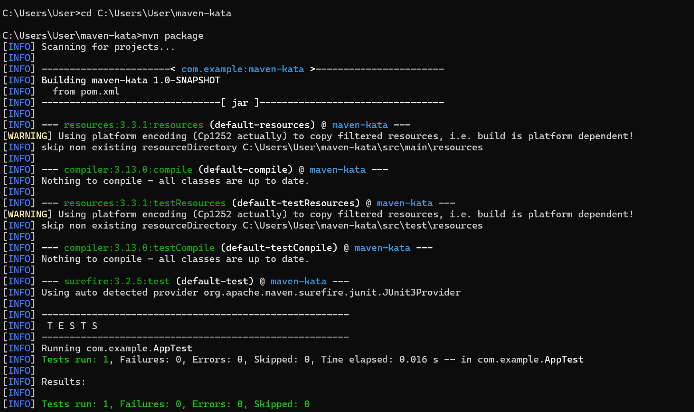
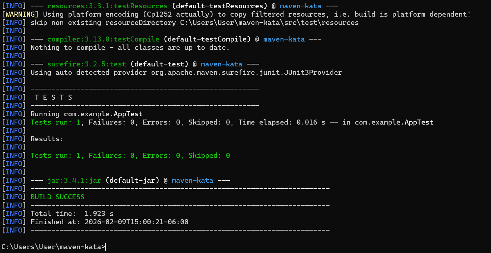

\# Maven Tutorial Submission


\## Goal

Understand how Maven lets you reuse artifacts across projects.


\## Steps Completed


1\. \*\*Install first project (`maven-kata`)\*\*

&nbsp;  - Ran:

&nbsp;  ```bash

&nbsp;  cd maven-kata

&nbsp;  mvn clean install


Output: Installed maven-kata-1.0-SNAPSHOT.jar to local Maven repository.


2\. Create second project (consumer-app)


Ran:


cd ..

mvn archetype:generate -DgroupId=com.example -DartifactId=consumer-app -DarchetypeArtifactId=maven-archetype-quickstart -DinteractiveMode=false

cd consumer-app


3\. Add maven-kata as a dependency


&nbsp; <groupId>com.example</groupId>

&nbsp; <artifactId>maven-kata</artifactId>

&nbsp; <version>1.0-SNAPSHOT</version>


4\. Compile the second project


mvn compile


5\. Package the second project

mvn package


The JAR was created at:

consumer-app\\target\\consumer-app-1.0-SNAPSHOT.jar


Screenshots for mvn package:




